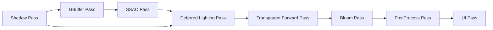
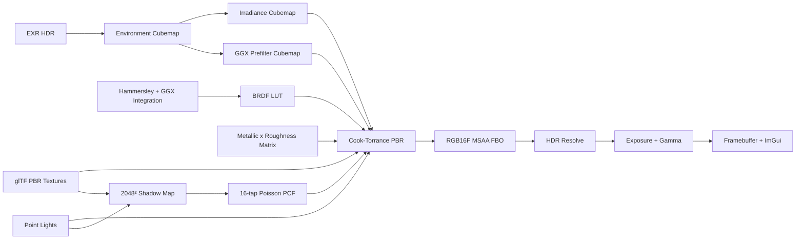

# OpenGL Renderer


一个面向实时图形渲染岗位的 C++17 / OpenGL 4.6 展示项目。项目包含可拆分的 Shadow、GBuffer、Lighting、Transparent、PostProcess 与 UI Pass，支持 Deferred PBR、SSAO、Bloom、ACES、透明物体 Forward Pass、IBL、软阴影，以及视锥裁剪、实例化和三级 LOD。所有渲染开关、调试缓冲区和性能数据都集中在 ImGui 中。

[GitHub 仓库](https://github.com/lizuoshuo-lab/OpenGL) · [观看 30 秒实机演示](docs/assets/opengl-ibl-showcase-30s.mp4)

## Gallery

| Deferred PBR Rock Field | 棋子到棋盘的软阴影 |
| --- | --- |
|  |  |

| Flight Helmet：6 套材质 | 5 x 5 BRDF 材质矩阵 |
| --- | --- |
|  |  |

| BoomBox | Toy Car：3 套材质 |
| --- | --- |
|  |  |

| Avocado | Lantern |
| --- | --- |
|  |  |

所有图片均来自当前可执行程序的真实运行画面。模型保留各自的 Base Color、Normal、Metallic-Roughness 与 AO 数据，并使用同一套运行时生成的 IBL 资源完成照明。

## Demo Focus

- **独立渲染 Pass**：Shadow、GBuffer、SSAO、Lighting、Transparent、Bloom、PostProcess 和 UI 有清晰的执行边界与独立 GPU 计时。
- **Deferred PBR**：GBuffer 保存 Position/AO、Normal/Roughness、Albedo/Metallic 与深度，光照阶段组合直接光、IBL 与 SSAO。
- **场景优化 A/B**：Rock 07 岩石场景可一键对比逐对象绘制与 Frustum Culling + GPU Instancing + 三级 LOD。
- **性能可视化**：实时显示 CPU/GPU 帧耗时、各 Pass GPU 耗时、Draw Call、三角形数、可见实例、LOD 分布和显存估算。
- **多材质模型展示**：包含 Avocado、Lantern、BoomBox、Flight Helmet、Toy Car 与 A Beautiful Game，覆盖 1 到 15 套源 glTF 材质。
- **可读的材质对比**：5 x 5 BRDF 矩阵横向改变 Metallic，纵向改变 Roughness，可直接观察高光形态和能量分布。
- **完整 IBL 链路**：EXR 转 Cubemap、Irradiance 卷积、GGX Prefilter、Split-Sum BRDF LUT 均在启动阶段由 GPU 生成。
- **棋子软阴影**：棋子写入 2048 x 2048 深度图，棋盘原有 PBR 材质通过 16 采样 Poisson PCF 接收柔化阴影，不额外添加地面。
- **可视化调试**：提供 Final、Direct Light、Diffuse IBL、Specular IBL、Irradiance、Prefilter、BRDF LUT、Normal、AO、Roughness、Metallic 等 12 个视图。
- **4K 全屏展示**：HDR/MSAA framebuffer、viewport、相机宽高比与 Windows 物理客户区同步更新，支持 Per-Monitor V2 高 DPI 和无标题栏全屏录制。

## ImGui Controls

| 分组 | 可操作内容 |
| --- | --- |
| Showcase | 八个场景切换、30 秒自动演示、自动旋转、速度、角度、缩放、视角重置 |
| Render Pipeline | Deferred/Forward、GBuffer 视图、SSAO、Bloom、Tone Mapper、AABB 与优化开关 |
| Performance | CPU/GPU 帧耗时、Pass Timer、Draw Call、三角形、实例、LOD 和显存估算 |
| Optimization A/B | 自动执行 Reference 与 Optimized 两组预热和采样，并展示降幅 |
| Soft Shadow | 阴影开关、强度、采样半径、深度偏移 |
| Output | Exposure、Clear Color、全屏切换、VSync |
| IBL | 12 个输出视图、环境强度、Reflection LOD |
| Material | Metallic、Roughness、AO、Normal 强度及重置 |
| Direct Lights | 总开关、单灯开关、位置、颜色、功率 |
| Camera | 位置、移动速度、鼠标灵敏度、相机重置 |

键盘 `1` 到 `8` 可快速切换材质矩阵、六个模型和 Rock Field，`F10` 可重新开始或停止 30 秒自动演示，`F11` 可在全屏与窗口模式之间切换。相机支持鼠标观察及 `W/A/S/D/Q/E` 六方向移动；ImGui 捕获输入时不会误触相机。

## Rendering Pipeline



Opaque PBR 物体进入延迟管线；透明材质在共享深度缓冲上执行 Forward Pass。PostProcess 支持 ACES、Exposure 和 Reinhard，GBuffer Inspector 可直接预览六个中间纹理。完整设计与统计口径见 [P0 渲染管线说明](docs/P0_RENDER_PIPELINE.md)。

### IBL Precomputation



关键实现入口：

- Pass 编排、延迟渲染与后处理：[glframework/renderer/renderPipeline.cpp](glframework/renderer/renderPipeline.cpp)
- GPU Timer Query：[glframework/renderer/gpuProfiler.cpp](glframework/renderer/gpuProfiler.cpp)
- Frustum、Instancing 与 LOD 展示：[glframework/renderer/frustum.cpp](glframework/renderer/frustum.cpp)、[application/optimizationShowcase.cpp](application/optimizationShowcase.cpp)
- IBL 资源生成：[glframework/texture.cpp](glframework/texture.cpp)
- PBR BRDF、PCF 阴影与调试输出：[assets/shaders/advanced/pbr/pbr.frag](assets/shaders/advanced/pbr/pbr.frag)
- glTF 层级和 PBR 材质读取：[application/assimpLoader.cpp](application/assimpLoader.cpp)
- 渲染遍历与 Shadow Pass：[glframework/renderer/renderer.cpp](glframework/renderer/renderer.cpp)
- HDR/MSAA、动态尺寸和展示控制：[main.cpp](main.cpp)、[glframework/framebuffer/framebuffer.cpp](glframework/framebuffer/framebuffer.cpp)

## Model Assets

| 模型 | 源 glTF Mesh / Material | 来源 | 许可 |
| --- | ---: | --- | --- |
| Avocado | 1 / 1 | [Khronos glTF Sample Assets](https://github.com/KhronosGroup/glTF-Sample-Assets/tree/main/Models/Avocado) | CC0 1.0 |
| Lantern | 1 / 1 | [Khronos glTF Sample Assets](https://github.com/KhronosGroup/glTF-Sample-Assets/tree/main/Models/Lantern) | CC0 1.0 |
| BoomBox | 1 / 1 | [Khronos glTF Sample Assets](https://github.com/KhronosGroup/glTF-Sample-Assets/tree/main/Models/BoomBox) | CC0 1.0 |
| Flight Helmet | 6 / 6 | [Khronos glTF Sample Assets](https://github.com/KhronosGroup/glTF-Sample-Assets/tree/main/Models/FlightHelmet) | CC0 1.0 |
| Toy Car | 3 / 3 | [Khronos glTF Sample Assets](https://github.com/KhronosGroup/glTF-Sample-Assets/tree/main/Models/ToyCar) | CC0 1.0 |
| A Beautiful Game | 15 / 15 | [Khronos glTF Sample Assets](https://github.com/KhronosGroup/glTF-Sample-Assets/tree/main/Models/ABeautifulGame) | CC BY 4.0 |
| Rock 07 | 1 / 1 | [Poly Haven](https://polyhaven.com/a/rock_07) / Jenelle van Heerden | CC0 |

完整来源、作者署名和扩展支持范围见 [assets/models/README.md](assets/models/README.md)。模型仅用于渲染功能展示，不主张其原始资产著作权。

## Build

要求：Windows x64、支持 OpenGL 4.6 的显卡驱动、Visual Studio 2022、CMake 3.12+、Git LFS。

```powershell
git clone https://github.com/lizuoshuo-lab/OpenGL.git
Set-Location .\OpenGL

git lfs install
git lfs pull

cmake -S . -B build -G "Visual Studio 17 2022" -A x64
cmake --build build --config Debug --parallel

Set-Location .\build
.\Debug\openglStudy.exe
```

程序使用相对资源路径，应从 `build` 根目录启动。每次构建完成后，CMake 会同步 `assets/`，并把 Assimp 运行时 DLL 复制到可执行文件目录。

展示录制可直接以全屏自动分镜模式启动：

```powershell
.\Debug\openglStudy.exe --fullscreen --demo
```

直接导出当前 OpenGL Back Buffer 为 4K PNG，保存完成后自动关闭：

```powershell
.\Debug\openglStudy.exe --fullscreen --showcase=8 --screenshot=verification\rock_field_4k.png
```

执行 Rock Field 的 Reference/Optimized 基准并自动关闭：

```powershell
.\Debug\openglStudy.exe --benchmark-exit
```

在 4K 显示器上运行时，程序会使用 `3840 x 2160` 物理客户区完成渲染；最终演示视频只录制 OpenGL 窗口客户区，不包含桌面和标题栏。

Windows 下可用录制脚本自动生成同款 30 秒成片。脚本等待无边框全屏真正生效后，通过 FFmpeg Desktop Duplication 与 NVENC 依次录制四个场景，并校验分辨率、帧率、帧数和时长：

```powershell
.\tools\record_showcase_4k.ps1 -BuildDirectory .\build -FfmpegPath ffmpeg
```

要求 FFmpeg 构建包含 `ddagrab` 过滤器和 `h264_nvenc` 编码器。

## Tech Stack

`C++17` · `OpenGL 4.6 Core` · `GLSL 460` · `GLFW` · `GLAD` · `GLM` · `Dear ImGui` · `Assimp` · `TinyEXR` · `stb_image` · `CMake`

## Project Highlights

- 设计独立 RenderPipeline 编排 Shadow、GBuffer、SSAO、Lighting、Transparent、Bloom、PostProcess 与 UI Pass，并为每个 GPU Pass 建立异步 Timer Query。
- 实现 Deferred Cook-Torrance PBR、半分辨率 SSAO/Bloom、ACES Tone Mapping、透明物体 Forward 合成和 GBuffer 可视化。
- 使用 AABB Frustum Culling、GPU Instancing 和三级 Mesh LOD 优化 Rock 07 场景；Debug 1600 x 900 实测 Draw Call 从 421 降至 29。
- 实现基于 Split-Sum Approximation 的 IBL 预计算与 Cook-Torrance PBR，覆盖 Irradiance、GGX Prefilter、BRDF LUT、HDR MSAA 和 Tone Mapping。
- 扩展 Assimp glTF 加载链路，保留节点局部变换并解析 PBR 纹理通道，对多层级模型自动计算世界包围盒和居中展示。
- 实现棋子到棋盘的 2048² Shadow Map 与 16 采样 Poisson PCF，支持在 ImGui 中实时调整阴影强度、半径与 Bias。

## Current Status

- Debug 构建通过，可执行程序已完成持续运行与交互检查。
- 自动 A/B 基准通过，测试结束后进程可自行关闭；优化模式 CPU 14.557 -> 2.856 ms、GPU 0.823 -> 0.363 ms、三角形 5.863M -> 0.690M。
- 已生成 3840 x 2160 的 Rock Field 全屏 PNG，内部 Back Buffer 导出避免桌面捕获黑屏。
- 七张真实运行截图和一段 30 秒、3840 x 2160、30 FPS、900 帧的 H.264 实机视频已就绪。
- 仓库源码目前没有单独声明许可证；第三方依赖和模型分别遵循各自许可证。
