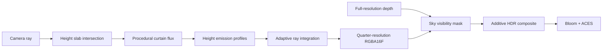

# 实时极光体积渲染

本场景实现的是面向实时展示的物理启发近似，不是空间天气或粒子输运模拟。目标是在现有 OpenGL 延迟渲染管线中保留极光最重要的视觉结构：随机弯曲的带状薄帘、随高度变化的发射颜色、断续亮边、次级褶皱和缓慢流动。竖向射线仅作为可调的弱细节，不再承担主体轮廓。


[播放 12 秒 1080p 预览](https://raw.githubusercontent.com/lizuoshuo-lab/OpenGL/main/docs/assets/aurora-preview-1080p.mp4) · [下载 4K 原片](https://github.com/lizuoshuo-lab/OpenGL/raw/refs/heads/main/docs/assets/aurora-showcase-12s.mp4)

## 物理依据

太阳活动产生的高能带电粒子沿地球磁场进入高层大气，与氧、氮原子或分子碰撞并使其进入激发态；退激发释放的光形成极光。NASA 的概述给出了适合实时近似的高度与颜色关系：约 100-200 km 的原子氧以绿色为主，约 200 km 以上可出现红色氧发射，较低高度的氮发射会贡献蓝色和粉紫色边缘。[NASA: Auroras](https://science.nasa.gov/sun/auroras/)

Lawlor 与 Genetti 的 GPU 极光体绘制方法把发光分布拆为两个主要部分：地表投影平面上的电子通量足迹，以及随高度变化的能量沉积分布。二者相乘得到三维发光体，再沿观察光线积分。该分解是当前实现的主要算法依据。[Interactive Volume Rendering Aurora on the GPU, WSCG 2011](https://www.cs.uaf.edu/~olawlor/papers/2010/aurora/lawlor_aurora_2010.pdf)

## 近似模型

### 1. 随机带状通量场

三层极光帘幕分别拥有独立的距离、方向和路径。每层首先用宽褶皱、扫掠褶皱和局部卷曲构造空间薄片中心，再用两个低频 fBm 场的差值产生类似大理石纹的断续带状遮罩。这样保留大尺度连续弧线，同时打破等距、等宽、互相平行的规则外观：

```text
warp(x, h, t) = fbm_1(x, h, t) - fbm_2(x, h, t)
z_i(x, h, t) = z0 - i * spacing + broadFold + sweepFold + localCurl
patch(x, h, t) = smoothstep(a, b, 1 - abs(fbm_1 - fbm_2))
```

带的高度路径由低频噪声、缓慢方向斜率和小幅周期折线共同决定。每层宽度随位置变化，并使用“较锐的下边缘、较软的上帘面、弱次级褶皱”构造非对称截面。细射线权重默认很低，只给局部增加亮度变化：

```text
h_i(x, z, t) = base_i + slope_i*x + beta*fbm(x, z, t) + smallFold
profile_i(h) = sharpLower(h - h_i) + softUpper(h - h_i) + foldedRidge
Phi(x, h, z, t) = sum_i sheetDistance_i * profile_i * patch_i * spanFade_i
```

这组约束让主体保持为有空隙的宽带，而不是整片雾墙；不同层可以交叉、断开或改变宽窄，也不会退化成笔直重复的竖纹。RPI 的 Sheet Modeling 工作将弧、带、褶皱和帷幕作为极光几何外观的主要类别，并使用曲线与随机扰动表达弯折结构。[Aurora Rendering with Sheet Modeling Technique](https://www.cs.rpi.edu/~cutler/classes/advancedgraphics/S09/final_projects/ng.pdf)

### 2. 高度沉积分层

高度归一化为 `h in [0, 1]`，绿、红、蓝三组发射使用不同中心和方差的高斯分布：

```text
D_green(h) = G(h; 0.31, 0.18) + 0.32 * G(h; 0.52, 0.25)
D_red(h)   = redWeight  * G(h; 0.83, 0.23)
D_blue(h)  = blueWeight * G(h; 0.055, 0.052)
```

最终局部发射近似为：

```text
L(x, h, z, t) = Phi(x, z, t) *
                (Cgreen*Dgreen(h) + Cred*Dred(h) + Cblue*Dblue(h))
```

这里的 RGB 颜色是对可见发射谱的显示近似，没有进行逐波长光谱积分。

### 3. 自适应视线积分

相机射线先与上下高度平面求交，只在有效高度区间采样。接近薄帘时缩短步长，空区域根据最近帘幕距离增大步长：

```text
C = integral T(s) * L(ray(s)) ds
T(s + ds) = T(s) * exp(-sigma * Phi(ray(s)) * ds)
```

极光在物理上接近光学薄介质，因此外部合成使用加法混合；积分内部只加入很弱的透射衰减，用于避免多层帘幕叠加后完全失去结构。

### 4. 低分辨率体积缓冲

体积积分写入四分之一宽高的 `RGBA16F` 缓冲。在 4K 输出下，极光缓冲为 `960 x 540`。随后线性上采样，并使用全分辨率 GBuffer 深度生成天空遮罩，将结果以加法方式合成回 HDR 颜色，再进入 Bloom 与 ACES。



这种处理将主要像素着色工作量降至全分辨率的约 `1/16`，同时由全分辨率深度维持山体轮廓。当前机器在 1600 x 900 控制面板截帧时显示约 `2.01 ms` 的显示帧时间；实际性能会随 GPU、分辨率和 Raymarch Steps 改变。

## ImGui 参数

- `Emission Intensity`：HDR 发光强度。
- `Raymarch Steps`：最大自适应采样预算，范围 16-96。
- `Motion Speed`：帘幕褶皱和细丝的时间变化速度。
- `Lower / Upper Height`：发光体积的高度边界。
- `Distance / Layer Spacing / Horizontal Span`：帘幕位置与覆盖范围。
- `Sheet Thickness / Fold Scale / Fold Strength / Turbulence`：薄帘形态。
- `Band Variation`：断续遮罩、路径宽度和随机带形的混合强度。
- `Ray Detail`：局部细射线权重，默认保持较低以突出带状主体。
- `Red Oxygen / Blue Nitrogen`：高层红光和低层蓝紫边缘的相对权重。
- `Green / Red / Blue Emission`：显示空间中的发射颜色。


## 实现入口

- 材质与参数：[auroraMaterial.h](../glframework/material/auroraMaterial.h)
- 体积顶点着色器：[aurora.vert](../assets/shaders/aurora.vert)
- 通量场、沉积分层与视线积分：[aurora.frag](../assets/shaders/aurora.frag)
- 深度感知 HDR 合成：[auroraComposite.frag](../assets/shaders/deferred/auroraComposite.frag)
- 低分辨率缓冲和 Transparent Pass 接入：[renderPipeline.cpp](../glframework/renderer/renderPipeline.cpp)
- 夜景场景与 ImGui 控制：[main.cpp](../main.cpp)

## 科学模拟边界

当前实现没有求解磁层粒子轨迹、碰撞截面、真实大气密度、地磁经纬度、电子能谱或逐波长辐射传输；高度值也采用场景单位而非直接使用千米。它适合研究岗位作品集中的实时渲染展示和算法讲解，不应作为极光位置、强度或颜色的科学预测工具。

若继续提高物理真实性，可按优先级加入磁力线坐标系、由电子能谱驱动的高度沉积查找表、真实发射线到线性 RGB 的光谱转换、地球曲率与大气散射，以及时间相干的二维流体通量纹理。

## 参考与开源实现

1. [NASA, Auroras](https://science.nasa.gov/sun/auroras/)：极光形成机制及主要颜色和高度关系。
2. [Lawlor and Genetti, Interactive Volume Rendering Aurora on the GPU](https://www.cs.uaf.edu/~olawlor/papers/2010/aurora/lawlor_aurora_2010.pdf)：二维通量足迹、高度沉积、体积积分与空区域加速。
3. [Baranoski et al., Simulating the Aurora](https://onlinelibrary.wiley.com/doi/10.1002/vis.304)：较早的极光图形模拟工作与真实图像比较。
4. [AuroraRendererUnity](https://github.com/olawlor/AuroraRendererUnity)：Lawlor 公开的 Unity/HLSL 参考实现，仓库声明相关 Shader 与数据采用 Unlicense/Public Domain。当前项目依据论文原理独立实现 GLSL，没有复制其 Shader 源码。
5. [Ng et al., Aurora Rendering with Sheet Modeling Technique](https://www.cs.rpi.edu/~cutler/classes/advancedgraphics/S09/final_projects/ng.pdf)：弧、带、帷幕和褶皱的薄片建模与随机扰动。
6. [Roy Theunissen, Aurora Borealis: A Breakdown](https://blog.roytheunissen.com/2022/09/17/aurora-borealis-a-breakdown/)：差分噪声形成大理石状通量纹理、二维足迹挤出和高度变化的实时实现思路。
