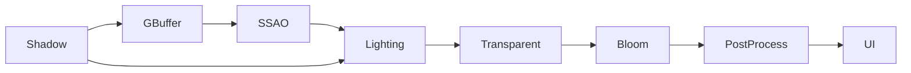

# P0 渲染管线与场景优化

## 目标

P0 将原先集中式 Forward 渲染整理为可观察、可切换、可量化的实时渲染管线。重点不是增加孤立效果，而是让每个效果有明确输入输出，并能在 ImGui 中验证中间结果和性能代价。

## Frame Graph



| Pass | 主要输入 | 主要输出 | 说明 |
| --- | --- | --- | --- |
| Shadow | 场景、光源 | Depth Map | 棋子软阴影使用 2048² 深度图与 Poisson PCF |
| GBuffer | Opaque PBR Mesh | 3 MRT + Depth | 一次几何遍历写入材质和几何信息 |
| SSAO | Position、Normal、Depth | 半分辨率 R16F AO | Kernel + Noise 采样，随后模糊 |
| Lighting | GBuffer、SSAO、IBL、Lights | RGBA16F HDR | Deferred Cook-Torrance PBR |
| Transparent | Transparent Mesh、共享 Depth | HDR 合成 | 保持排序与 Alpha Blend，走 Forward PBR |
| Bloom | HDR | 半分辨率 RGBA16F | 亮度提取与 Ping-Pong Blur |
| PostProcess | HDR、Bloom | Back Buffer | ACES、Exposure 或 Reinhard |
| UI | Back Buffer | 最终画面 | ImGui 在后处理之后绘制 |

## GBuffer 布局

| Attachment | 格式 | 通道 |
| --- | --- | --- |
| Position / AO | RGBA16F | RGB = World Position，A = Material AO |
| Normal / Roughness | RGBA16F | RGB = World Normal，A = Roughness |
| Albedo / Metallic | RGBA8 | RGB = Base Color，A = Metallic |
| Depth | Depth24 | 深度测试、透明 Forward Pass 与调试视图共享 |

ImGui 的 `Output Buffer` 可以全屏查看 World Position、World Normal、Albedo、AO、Roughness、Metallic、SSAO、Bloom 和 Depth；`GBuffer Inspector` 可以同时查看缩略图。

## 性能统计

- CPU Frame：`RenderPipeline::render` 的 CPU 墙钟时间。
- GPU Frame：OpenGL `GL_TIME_ELAPSED` 异步查询的整帧结果。
- GPU Pass Timings：每个独立 Pass 的 Timer Query 结果，延迟读取以避免同步等待。
- Draw Calls / Triangles：由实际提交的 Mesh、Instance Count 和索引数统计。
- Instance / LOD：显示逻辑总实例、可见实例、剔除数量及 High/Medium/Low 分布。
- VRAM Estimate：几何、纹理与当前分辨率 Render Target 的字节估算，不等同于驱动实际驻留值。

## Rock Field 优化

展示场景使用 Poly Haven 的 Rock 07 高精度模型，并生成 Medium/Low 两级简化岩石。确定性散布保证 Reference 与 Optimized 使用相同场景和相机。

| 模式 | Frustum Culling | GPU Instancing | LOD |
| --- | --- | --- | --- |
| Reference | Off | Off | High only |
| Optimized | On | On | 30 / 55 world-unit thresholds |

Reference 使用逐对象 Draw Call，便于建立基线；Optimized 先执行 AABB 视锥裁剪，再按 LOD 分组提交实例。AABB 可在 ImGui 中随时显示，检查剔除边界。

## A/B 实测

测试环境为 Debug、1600 x 900；每组预热 30 帧、采样 90 帧。数值受显卡、驱动和后台负载影响，仓库中的结果用于说明同机相对变化。

| 指标 | Reference | Optimized | 降幅 |
| --- | ---: | ---: | ---: |
| CPU Frame | 14.557 ms | 2.856 ms | 80.4% |
| GPU Frame | 0.823 ms | 0.363 ms | 55.9% |
| Draw Calls | 421 | 29 | 93.1% |
| Triangles | 5,863,442 | 690,278 | 88.2% |

## 操作入口

1. 在 `Showcase` 选择 `GPU Rock Field`。
2. 在 `Render Pipeline` 切换 Deferred/Forward、GBuffer、SSAO、Bloom、Tone Mapper、Culling、Instancing、LOD 和 AABB。
3. 在 `Performance` 查看整帧与各 Pass 数据。
4. 在 `Optimization A/B` 点击 `Run Reference vs Optimized`，程序会自动完成两组预热和采样。

命令行也可无人值守执行：

```powershell
# 跑完 A/B 后自动关闭
.\Debug\openglStudy.exe --benchmark-exit

# 在第 90 帧导出 4K Back Buffer，成功后自动关闭
.\Debug\openglStudy.exe --fullscreen --showcase=8 --screenshot=verification\rock_field_4k.png
```

## 资产来源

- [Rock 07](https://polyhaven.com/a/rock_07)，Jenelle van Heerden / Poly Haven，CC0。
- [Forest Slope HDRI](https://polyhaven.com/a/forest_slope)，Poly Haven，CC0。
