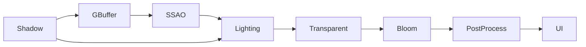

# P0 渲染管线与场景优化

## 目标

P0 将原先集中式 Forward 渲染整理为可观察、可切换、可量化的实时渲染管线。重点不是增加孤立效果，而是让每个效果有明确输入输出，并能在 ImGui 中验证中间结果和性能代价。

## Frame Graph



| Pass | 主要输入 | 主要输出 | 说明 |
| --- | --- | --- | --- |
| Shadow | 场景、光源 | Depth Map | 棋子软阴影使用 2048² 深度图与 Poisson PCF |
| GBuffer | Opaque PBR Mesh | 3 MRT + Depth | 一次几何遍历写入材质和几何信息 |
| SSAO | Position、Normal、Depth | 半分辨率 R16F AO + 全分辨率 AO | 最高 64 样本 Kernel + Noise，7 x 7 双边滤波并联合上采样 |
| Lighting | GBuffer、SSAO、IBL、Lights | RGBA16F HDR | Deferred Cook-Torrance PBR |
| Transparent | Transparent Mesh、共享 Depth | HDR 合成 | 保持排序与 Alpha Blend，走 Forward PBR |
| Bloom | HDR | 半分辨率 RGBA16F | 亮度提取与 Ping-Pong Blur |
| PostProcess | HDR、Bloom | Back Buffer | ACES、Exposure 或 Reinhard |
| UI | Back Buffer | 最终画面 | ImGui 在后处理之后绘制 |

## GBuffer 布局

| Attachment | 格式 | 通道 |
| --- | --- | --- |
| Position / AO | RGBA16F | RGB = World Position，A = Material AO |
| Normal / Roughness | RGBA16F | RGB = World Normal，A = Roughness |
| Albedo / Metallic | RGBA8 | RGB = Base Color，A = Metallic |
| Depth | Depth24 | 深度测试、透明 Forward Pass 与调试视图共享 |

ImGui 的 `Output Buffer` 可以全屏查看 World Position、World Normal、Albedo、AO、Roughness、Metallic、SSAO Only、Bloom 和 Depth；`GBuffer Inspector` 可以同时查看缩略图。`Pipeline` 可在 `Deferred + SSAO` 与独立的 `Forward PBR` 之间切换。

## SSAO-only Gallery


第 9 个场景使用墙角、台阶、底座、球体和贴墙物体构造接触遮蔽测试。进入场景后自动选择 Deferred 管线与 SSAO-only 输出：AO 在半分辨率下使用 64 个半球样本计算，再以 World Position 和 World Normal 为约束执行 7 x 7 双边滤波和全分辨率联合上采样；最终灰度调试输出使用 FXAA 平滑单采样 GBuffer 的几何边缘。白色表示无遮挡，暗部集中在接触点、缝隙和墙角。

```powershell
.\Debug\openglStudy.exe --fullscreen --showcase=9 --no-ui --screenshot=verification\ssao_gallery_4k.png
```

## 性能统计

- CPU Frame：`RenderPipeline::render` 的 CPU 墙钟时间。
- GPU Frame：OpenGL `GL_TIME_ELAPSED` 异步查询的整帧结果。
- GPU Pass Timings：每个独立 Pass 的 Timer Query 结果，延迟读取以避免同步等待。
- Draw Calls / Triangles：由实际提交的 Mesh、Instance Count 和索引数统计。
- Instance / LOD：显示逻辑总实例、可见实例、剔除数量及 High/Medium/Low 分布。
- VRAM Estimate：几何、纹理与当前分辨率 Render Target 的字节估算，不等同于驱动实际驻留值。

## Asteroid Belt 优化

展示场景使用 Poly Haven 的 Moon Rock 01、02、06 三套 2K glTF 月岩，构成 5000 颗确定性分布的高密度小行星带。三组材质分别表现硅酸盐、碳质岩和金属陨石。中心行星使用 USGS/NASA Viking 全球拼接图作为 4K Albedo，并保持 Metallic 为 0、Roughness 为 1；场景不再添加透明大气球，因此没有额外外圈。天空盒使用纯暗宇宙底色；星点由 GLSL 在屏幕空间生成为抗锯齿小圆点，不受相机远距离环绕影响，并只允许少量星点异步改变亮度。背景不包含大气渐变、银河照片、月亮或大光斑；PBR 的 Irradiance 与 GGX Prefilter 仍由 Qwantani Night EXR 生成。

行星、单颗小行星和带状轨道分别使用三层变换：中心行星绕自身轴旋转，每颗小行星保留独立随机旋转轴，Reference 与 Instanced 两棵场景树共享同一公转父矩阵。相机可在固定高度和半径上绕中心行星旋转，并逐帧重建 LookAt 基向量。基准采样期间冻结场景与相机动画，确保两个模式比较同一姿态。

Medium/Low 网格由 meshoptimizer 从每个原始 glTF primitive 的索引缓冲生成，继续使用同一套顶点位置、UV、法线、切线和 `PbrMaterial`，不再替换为通用代理模型。LOD 判定使用 `相机距离 / 实例最大缩放` 的投影距离近似；High/Medium 与 Medium/Low 在各自过渡区同时提交，并通过逐实例淡化值和稳定的屏幕空间互补抖动控制覆盖率。两个层级的覆盖率之和保持为 1，因此材质、亮度和轮廓不会在阈值处瞬间切换。

| 模式 | Frustum Culling | GPU Instancing | LOD |
| --- | --- | --- | --- |
| Reference | Off | Off | High only |
| Optimized | On | On | High→Medium 170-260；Medium→Low 420-620（投影距离近似） |

Reference 使用逐对象 Draw Call，便于建立基线；Optimized 先执行 AABB 视锥裁剪，再按 LOD 与材质分组提交实例。每次实例绘制都会重新绑定当前批次的矩阵与淡化属性，避免共享几何 VAO 时不同材质批次读取到错误的实例缓冲。AABB 可在 ImGui 中随时显示，检查剔除边界。

## A/B 实测

测试环境为 Debug、1600 x 900；每组预热 30 帧、采样 90 帧。数值受显卡、驱动和后台负载影响，仓库中的结果用于说明同机相对变化。

| 指标 | Reference | Optimized | 降幅 |
| --- | ---: | ---: | ---: |
| CPU Frame | 390.684 ms | 33.430 ms | 91.44% |
| GPU Frame | 197.731 ms | 2.531 ms | 98.72% |
| Draw Calls | 10,233 | 34 | 99.67% |
| Triangles | 49,025,780 | 26,392,466 | 46.17% |

## 操作入口

1. 在 `Showcase` 选择 `GPU Asteroid Belt`。
2. 在 `Render Pipeline` 切换 Deferred/Forward、GBuffer、SSAO、Bloom、Tone Mapper、Culling、Instancing、LOD 和 AABB。
3. 在 `Performance` 查看整帧与各 Pass 数据。
4. 在 `Optimization A/B` 点击 `Run Reference vs Optimized`，程序会自动完成两组预热和采样。
5. 在 `Orbital Motion` 控制小行星带公转、行星自转、单颗小行星自转倍率、相机环绕与运动重置。
6. 在 `Geological Planet` 调整行星 Tint、Roughness 与 Terrain Relief，在 `Asteroid Materials` 分别调整三类小行星的 Base Color、Metallic 与 Roughness。

命令行也可无人值守执行：

```powershell
# 跑完 A/B 后自动关闭
.\Debug\openglStudy.exe --showcase=8 --benchmark-exit --no-ui

# 在第 90 帧导出 4K Back Buffer，成功后自动关闭
.\Debug\openglStudy.exe --fullscreen --showcase=8 --no-ui --screenshot=verification\asteroid_belt_4k.png
```

## 资产来源

- [Moon Rock 01](https://polyhaven.com/a/moon_rock_01)，Poly Haven，CC0。
- [Moon Rock 02](https://polyhaven.com/a/moon_rock_02)，Poly Haven，CC0。
- [Moon Rock 06](https://polyhaven.com/a/moon_rock_06)，Poly Haven，CC0。
- [Moon Meteor 01](https://polyhaven.com/a/moon_meteor_01)，行星微表面 Normal，Poly Haven，CC0。
- [Qwantani Night Pure Sky](https://polyhaven.com/a/qwantani_night_puresky)，IBL HDR 输入，Poly Haven，CC0。
- [Mars Viking Colorized Global Mosaic](https://astrogeology.usgs.gov/search/map/mars_viking_colorized_global_mosaic_232m)，USGS Astrogeology / NASA Ames，Public domain。
