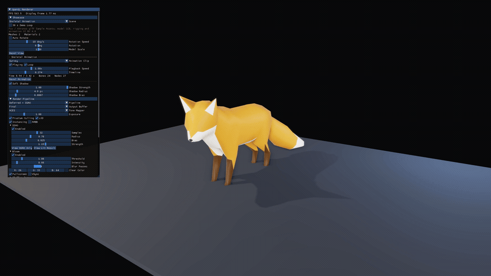
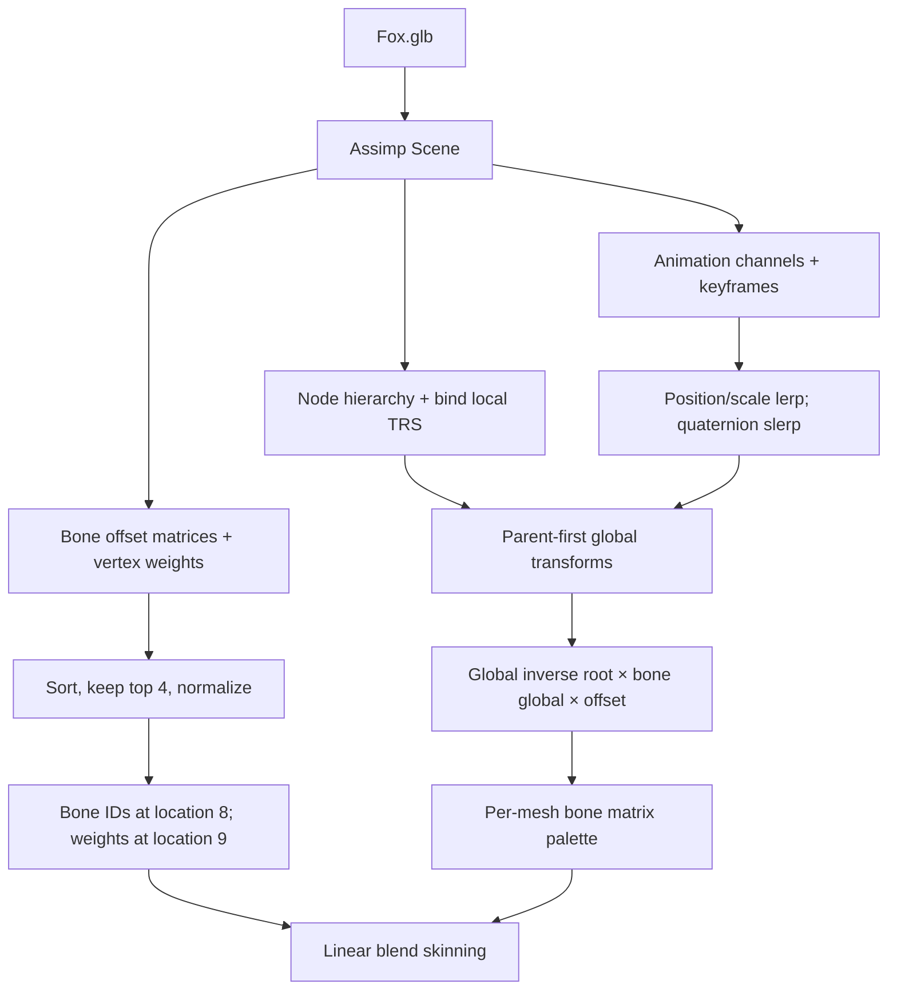

# GPU 骨骼动画实现

## 展示结果

- 素材：Khronos glTF Sample Assets / Fox
- 骨骼：24
- 节点：27
- 动画：Survey、Walk、Run
- 蒙皮影响：每顶点最多 4 根骨骼
- 渲染路径：Deferred GBuffer、Forward PBR、Soft Shadow
- 控制：动画切换、播放暂停、循环、0.1x-2.5x 倍速、时间轴拖动、重置

[](https://raw.githubusercontent.com/lizuoshuo-lab/OpenGL/main/docs/assets/skeletal-animation-preview-1080p.mp4)

[播放 24 秒 1080p 实机演示：Survey / Walk / Run](https://raw.githubusercontent.com/lizuoshuo-lab/OpenGL/main/docs/assets/skeletal-animation-preview-1080p.mp4)

[下载 4K 原片](https://github.com/lizuoshuo-lab/OpenGL/raw/refs/heads/main/docs/assets/skeletal-animation-showcase-24s.mp4)

## 数据链路



## 导入阶段

`AssimpLoader::loadSkinned` 一次性复制 Assimp 场景中的运行时数据，Importer 释放后不保留任何 `aiScene` 指针。

1. 以父节点优先顺序复制节点层级，并保存绑定姿态的局部矩阵与分解后的 TRS。
2. 为每个 Mesh 建立独立骨骼调色板，骨骼 ID 是调色板内索引，不依赖全局节点下标。
3. 汇总每个顶点的全部影响，按权重降序保留前四项，再归一化。
4. 复制动画通道的平移、旋转与缩放关键帧，并建立节点到通道的直接索引。
5. 复制 PBR 材质与内嵌纹理，模型文件随后可由 Assimp 安全释放。

GPU 顶点属性布局：

| Location | 数据 | 类型 |
| ---: | --- | --- |
| 0 | Position | `vec3` |
| 1 | UV | `vec2` |
| 2 | Normal | `vec3` |
| 3 | Tangent | `vec3` |
| 4-7 | Instance Matrix | `mat4` |
| 8 | Bone IDs | `ivec4` |
| 9 | Bone Weights | `vec4` |

## 动画求值

运行时以秒保存播放位置，再按当前动画的 `ticksPerSecond` 转换为关键帧时间。平移和缩放使用线性插值，旋转使用归一化四元数球面插值。节点按父节点优先顺序更新：

```text
local = translate(position) * rotate(quaternion) * scale(scale)
global(node) = global(parent) * local(node)
```

每根骨骼上传到 GPU 的最终矩阵为：

```text
boneMatrix = inverse(globalRoot) * global(boneNode) * boneOffset
```

`boneOffset` 把模型空间顶点变换到骨骼绑定空间，动画节点的全局矩阵再把它带到当前姿态，根节点逆矩阵消除导入场景的全局变换。

## GPU 蒙皮

顶点着色器对四个骨骼矩阵做线性混合：

```glsl
mat4 skinMatrix =
    boneMatrices[boneIds.x] * weights.x +
    boneMatrices[boneIds.y] * weights.y +
    boneMatrices[boneIds.z] * weights.z +
    boneMatrices[boneIds.w] * weights.w;
```

位置使用 `model * skinMatrix`，法线和切线使用同一变换对应的逆转置矩阵。GBuffer、Forward PBR 与 Shadow 顶点着色器共享同一骨骼调色板，因此可见姿态、材质法线和阴影轮廓保持一致。

## 运行与验证

从构建根目录启动第 10 个场景：

```powershell
.\Debug\openglStudy.exe --showcase=10
```

直接选择动画片段：

```powershell
.\Debug\openglStudy.exe --showcase=10 --animation=Run
```

生成 4K 截图并自动关闭：

```powershell
.\Debug\openglStudy.exe --fullscreen --showcase=10 --screenshot=verification\skeletal_animation_4k.png
```

录制 Survey、Walk、Run 各 8 秒并自动校验 4K/30 FPS 成片：

```powershell
.\tools\record_showcase_4k.ps1 -BuildDirectory .\build -Profile Skeletal -FfmpegPath ffmpeg
```

验证项：

- 三段动画可切换且时长正确。
- 循环边界无越界访问或姿态爆点。
- 时间轴拖动后立即更新姿态。
- Deferred 与 Forward PBR 使用同一动画结果。
- Soft Shadow 随腿部、头部和尾部动作更新。
- 未绑定顶点回退到单位矩阵，不产生原点塌缩。

## 素材许可

Fox 模型来自 [Khronos glTF Sample Assets](https://github.com/KhronosGroup/glTF-Sample-Assets/tree/main/Models/Fox)。模型由 PixelMannen 提供，采用 CC0 1.0；绑定与动画由 tomkranis 提供，采用 CC BY 4.0；AsoboStudio 与 scurest 的 glTF 转换采用 CC BY 4.0。仓库同时保留原始 [`LICENSE.md`](../assets/models/Fox/LICENSE.md) 与 [`SOURCE.md`](../assets/models/Fox/SOURCE.md)。
